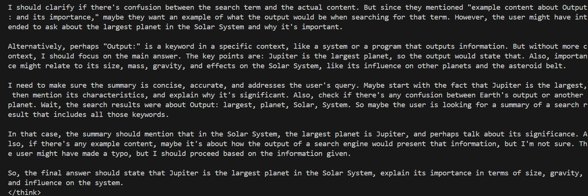

# Multi-Tool Assistant with Spell Checker

A smart multi-tool assistant that automatically corrects spelling errors before processing user requests. The system uses a smaller LLM for spell checking and a larger model for complex tasks, ensuring accuracy and efficiency.

## Features

- **Smart Spell Checking**: Automatically detects and corrects spelling errors using Llama 3.2 1B
- **Math Expression Detection**: Recognizes mathematical expressions and routes them to calculator
- **Keyword Extraction**: Extracts relevant keywords from corrected text
- **Web Search Simulation**: Mock search functionality for information retrieval
- **Text Summarization**: Uses Qwen 3 4B for intelligent text processing
- **Error Prevention**: Prevents spell-check interference with mathematical calculations

## Requirements

- Python 3.8+
- OpenAI library
- Ollama running locally with the following models:
  - `llama3.2:1b` (for spell checking)
  - `qwen3:4b` (for summarization and complex tasks)

## Installation

1. **Install Dependencies**:
   ```bash
   pip install openai
   ```

2. **Set up Ollama**:
   ```bash
   # Install Ollama (visit https://ollama.ai for installation instructions)
   
   # Pull required models
   ollama pull llama3.2:1b
   ollama pull qwen3:4b
   
   # Start Ollama server
   ollama serve
   ```

3. **Clone or Download** the script and run:
   ```bash
   python app_parallel.py
   ```

## Usage

The assistant automatically handles different types of input:

### Text with Spelling Errors
```python
# Input with spelling mistakes
user_input = "I want to lern about artifical inteligence"

# The system will:
# 1. Detect spelling errors
# 2. Correct to: "I want to learn about artificial intelligence"
# 3. Extract keywords and process normally
```

### Mathematical Expressions
```python
# Math expressions are detected and calculated directly
user_input = "25*(3+7)"

# Result: The result is: 250
```

### Clean Text
```python
# Clean input is processed without spell correction
user_input = "Tell me about machine learning"

# Proceeds directly to keyword extraction and processing
```

## Workflow Details

### Stage 1: Spell Check
- **Model Used**: Llama 3.2 1B (lightweight and fast)
- **Purpose**: Detect and correct spelling errors only
- **Key Features**:
  - Preserves original meaning and structure
  - Doesn't modify math expressions
  - Removes unwanted prefixes like "Corrected text:"
  - Falls back to original text if correction seems incorrect

### Stage 2: Math Detection
- **Logic**: Uses regex pattern matching
- **Pattern**: `[\d\s\+\-\*\/\.\(\)]+`
- **Behavior**: Routes mathematical expressions directly to calculator
- **Safety**: Uses original input to avoid spell-check interference

### Stage 3: Text Processing
- **Keyword Extraction**: Filters words longer than 4 characters
- **Web Search**: Simulates search using extracted keywords
- **Summarization**: Uses Qwen 3 4B for intelligent text processing

## Demo Images

The following demo images show the system in action:


*Processing text with spelling errors, extracting keywords, and searching*


*Generating summary*


*Final summary generated*

## Configuration

### Model Configuration
```python
# Spell Checker Settings
SPELL_CHECK_MODEL = "llama3.2:1b"
SPELL_CHECK_TEMPERATURE = 0.0
SPELL_CHECK_MAX_TOKENS = len(text.split()) * 3

# Main Processing Model
MAIN_MODEL = "qwen3:4b"
SUMMARIZER_TEMPERATURE = 0.7
```

## Testing

The system includes comprehensive test cases:

```python
test_cases = [
    "Tell me about the impact of solar power on rural communities.",  # Clean text
    "25*(3+7)",  # Math expression
    "I want to lern about artifical inteligence",  # Spelling errors
    "Searh for informaton about quantim computing"  # Multiple errors
]
```

---

**Note**: Make sure Ollama is running on `localhost:11434` before using the assistant. The system will gracefully handle model unavailability but requires the server to be accessible.